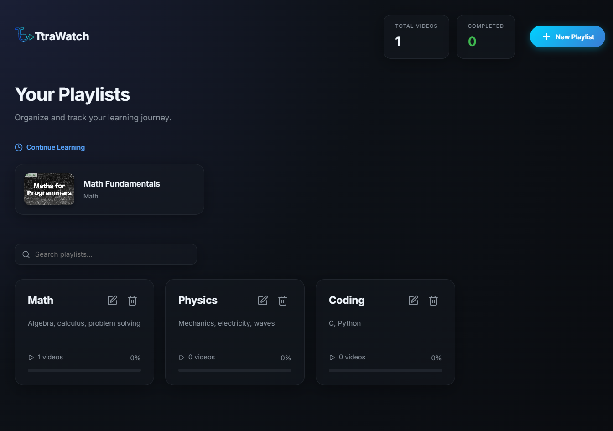

# TtraWatch 📺

TtraWatch is a focused, productivity-first YouTube playlist manager and video player designed for organized learning. It allows users to curate their educational content into custom playlists, providing a distraction-free environment for deep work and skill acquisition.



## 🚀 Purpose

The primary goal of TtraWatch is to solve the problem of distraction on YouTube. By extracting videos into a dedicated management tool, users can:
- **Focus on Learning:** Eliminate recommendations, comments, and other distractions.
- **Stay Organized:** Categorize videos into specific subjects (e.g., Math, Physics, Chemistry).
- **Track Progress:** Monitor learning milestones with completion tracking and statistics.

## ✨ Key Features

- **Custom Playlists:** Create, edit, and manage multiple playlists for different learning paths.
- **Video Management:** Add YouTube videos easily via URL with automatic thumbnail integration.
- **Progress Tracking:** Mark videos as "Active" or "Completed" and visualize your progress with dynamic progress bars.
- **Dashboard Overview:** Get a bird's-eye view of your learning stats, including total videos and completion rates.
- **Search & Filter:** Quickly find specific playlists or videos in your library.
- **Modern UI/UX:** A clean, responsive interface with smooth animations and intuitive navigation.
- **Security Focused:** Built-in protection against common web vulnerabilities like XSS and DDoS.

## 🛠️ Tech Stack

- **Frontend:**
  - Vanilla JavaScript (SPA Architecture)
  - Custom CSS (Tailwind-inspired styling)
  - [Lucide](https://lucide.dev/) for iconography
  - [Motion](https://motion.dev/) for smooth animations
- **Backend:**
  - [Node.js](https://nodejs.org/) & [Express](https://expressjs.com/)
  - [better-sqlite3](https://github.com/WiseLibs/better-sqlite3) for lightweight, fast data storage
- **Security:**
  - [Helmet](https://helmetjs.github.io/) for secure HTTP headers
  - [Express Rate Limit](https://www.npmjs.com/package/express-rate-limit) for DDoS protection
  - [Sanitize-HTML](https://www.npmjs.com/package/sanitize-html) for XSS prevention
- **Build Tool:**
  - [Vite](https://vitejs.dev/)

## 🏁 Getting Started

### Prerequisites
- Node.js installed on your machine.

### Installation
1. Clone the repository.
2. Install dependencies:
   ```bash
   npm install
   ```

### Running the App
Start the development server (runs both backend and frontend via Vite):
```bash
npm run dev
```
The app will be available at `http://localhost:3000`.

### Production Build
To create a production-ready build:
```bash
npm run build
```
> ⚠️ **Important**: In order to add an entire playlist at once, you **must** have the **Google YouTube Data API v3** enabled and configured. Make sure to set up your API key before proceeding with the security guidelines below. for more info read **API_KEY_SAFETY.MD**

---


Designed with ❤️ by AnkitCodex for focused learners.
